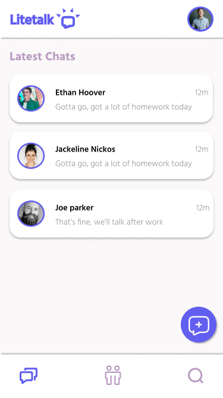

# Hi, I am Khadidja Arezki 👋
### Full Stack Web Developer
🔥 I am passionate about computer science 
🌱 I’m currently learning Functional Programming 
🔭 I’m currently working on my problem-solving skills 
👯 I’m looking to collaborate on a React project 
🤔 I’m looking for help with building my developer network 
💬 Ask me about the core Javascript language features 
📫 How to reach me: 📧  khadidjaarezki999@gmail.com 
⚡ Fun fact: I took a Linux course on a Windows machine. It was hell!

## Projects:
1. 💲 Pricelee (personal project): An online price tracker
 &nbsp;&nbsp;&nbsp;&nbsp;➡️ [frontend repository link](https://github.com/KhadidjaArezki/pricelee-mern-frontend)
 &nbsp;&nbsp;&nbsp;&nbsp;➡️ [backend repository link](https://github.com/KhadidjaArezki/pricelee-mern-backend)
 &nbsp;&nbsp;&nbsp;&nbsp; 📸 Screenshots: 👇 
 

2. 💬 Litetalk (team project created at [Chingu](https://www.chingu.io/)): A lightweight social media app for connecting with family and friends. You can chat and share media.
 &nbsp;&nbsp;&nbsp;&nbsp;➡️ [repository link](https://github.com/chingu-voyages/v39-bears-team-11)
 &nbsp;&nbsp;&nbsp;&nbsp; 📸 Screenshots: 👇 
 

## 🌐 Socials:
 

# 💻 Tech Stack:
                       	  
# 📊 GitHub Stats:
 
 

## 🏆 GitHub Trophies

### ✍️ Random Dev Quote

<!---### 😂 Random Dev Meme
<!---

---
<!---

